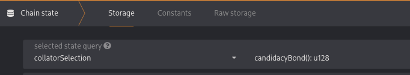
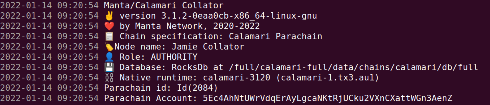
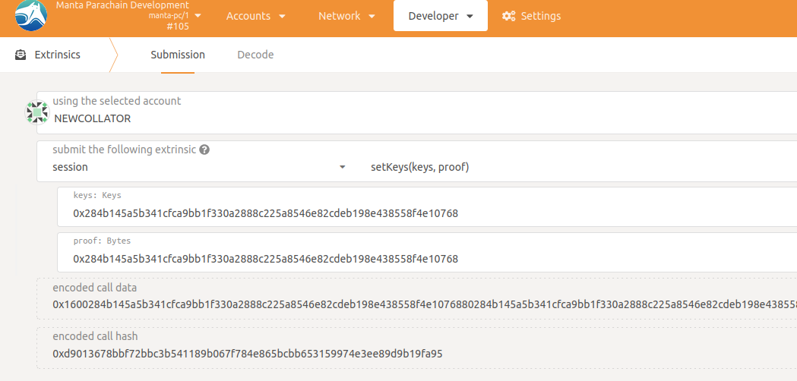
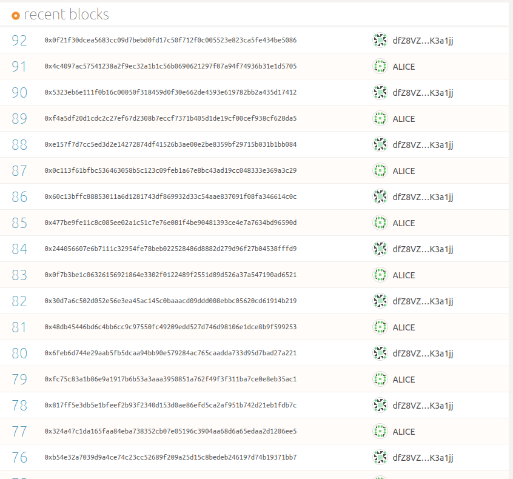
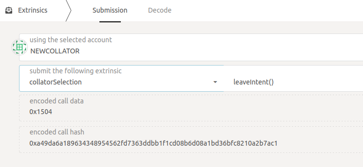
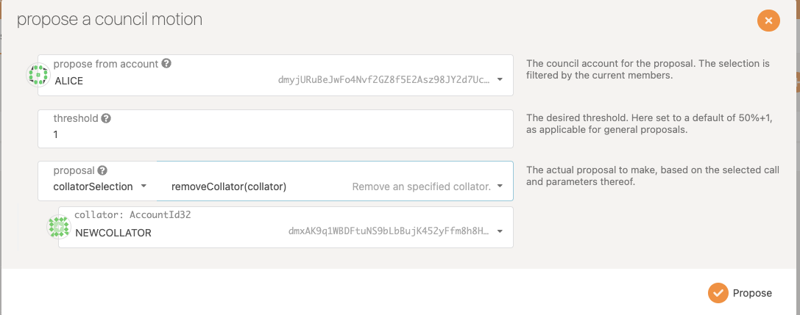

# 🧩  Community Collators Program

## Requirements

1. Hardware Requirement

    a. If running on your own machine, hardware requirement, internet bandwidth
    
    ```jsx
    cpu:8 cores
    memory: 32 GB of ram
    disk space: 500 GB of disk space
    bandwidth: 100 Mbps
    recommended region: EU or US
    ```
    
    b. If running on AWS, instance type and the location guide
    
    ```jsx
    AWS instance: Ubuntu 20.04 (ami-id = ami-04505e74c0741db8d)
    disk space: r5ad.xlarge
    recommended region: ca-central, eu-west, eu-central, eu-north, us-east
    ```
    
    NOTE: 
    
    - A calamari collator utilizes up to 27gb of ram on a 32gb system.
    - A calamari collator utilizes up to 25% of cpu on a 24 core system.
    - A reliable internet connection as well as power supply which should remain uninterrupted to keep local machine **permanently online.**

2. Bonding requirement: `400_000`KMA at least. Make sure your account has more than `400_000`KMA in your free balance.

    You can check candidacy bond on calamari mainnet.
    

## Deployment

### Tips:

1. The node can be deployed by native binary or docker, it depends on your preference.
    - [Native](#deploy-a-collator-on-ubuntu-using-native-binary)
    - [Docker](#deploy-a-collator-on-ubuntu-using-docker)
2. We provide a recent snapshot which can shorten the time on catching up calamari mainnet.

### Deploy a collator on Ubuntu using native binary

We recommend run on Ubuntu **`20.04 LTS`** :
1. Get latest manta binary from manta repo: [https://github.com/Manta-Network/Manta/releases](https://github.com/Manta-Network/Manta/releases)
    
- Get calamari genesis file: [https://github.com/Manta-Network/Manta/blob/manta/genesis/calamari-genesis.json](https://github.com/Manta-Network/Manta/blob/manta/genesis/calamari-genesis.json)
- Get relaychain(kusama) genesis: [https://github.com/paritytech/polkadot/blob/master/node/service/res/kusama.json](https://github.com/paritytech/polkadot/blob/master/node/service/res/kusama.json)

2. Start a collator by the following command with RPC port enabled. Please specify `your_db_path`.

    > If you want to start collator with snapshot, download snapshot from [here](#download-snapshot),
    > follow this [section](#native) to deploy node with snapshot.

    ```bash
    manta --base-path your_db_path \    
    --name your_collator_name \
    --chain calamari-genesis.json \
    --rpc-cors 'all' \
    --port 30333 \
    --rpc-port 9933 \
    --rpc-methods=Unsafe \
    --force-authoring \
    --collator \
    -- \
    --chain kusama.json
    ```

    Ensure you can see a line of log like this:

    ```bash
    👤 Role: AUTHORITY
    ```

    

3. Generate session keys.

    ```bash
    curl -H 'Content-Type: application/json' --data '{ "jsonrpc":"2.0", "method":"author_rotateKeys", "id":1 }' http://localhost:9933
    ```

    You should get a response like this:

    ```jsx
    {"jsonrpc":"2.0","result":"0x06736e65ab33fd1e4e3e434a1fa2c5425f0e263ddb50e6aeb15951288c562f61","id":1}
    ```

    The `result` is the session keys.

4. Once you get the session keys, you should restart the node and disable RPC port for security.

    ```bash
    manta --base-path your_db_path \
    --name your_collator_name \
    --chain calamari-genesis.json \
    --port 30333
    --collator \
    -- \
    --chain kusama.json
    ```

    Ensure you can see a line of log like this:

    ```bash
    👤 Role: AUTHORITY
    ```

    

5. Ensure your node is fully synchronised to both chains, has peers on both, is showing no/a small difference between best and finalized numbers and is keeping up with new blocks
    
    ```jsx
    2022-01-25 14:15:09 [Parachain] 💤 Idle (6 peers), best: #14424 (0xfc03…2d99), finalized #14423 (0x72b6…a087), ⬇ 0.8kiB/s ⬆ 1.0kiB/s
    2022-01-25 14:15:09 [Relaychain] 💤 Idle (9 peers), best: #570132 (0x8929…0353), finalized #570130 (0xb471…6943), ⬇ 5.2kiB/s ⬆ 3.3kiB/s
    ```

    If you have 0 peers on the relaychain and/or your node is failing to verify new  blocks, ensure your node’s clock is accurate, e.g. by forcing a sync with an NTP timeserver 

    ```jsx
    2022-01-25 13:47:49 [Relaychain] 💔 Verification failed for block 0xbd3bf6d173daad66fef2325d3a1bc3141de630519ad0c390ccafec9d24faeba7 received from peer: 12D3KooW9tzdaAsSfzY97cPwSFx8ALxci1sppCHJaSddDrxs9FCp, "Header 0xbd3bf6d173daad66fef2325d3a1bc3141de630519ad0c390ccafec9d24faeba7 rejected: too far in the future" rification failed for block 0xf8
    ```
    
6. Bond your account id with session keys which are generated from `step-3`.

    

    Both params should be the same.

7. Fill the [collator application](https://docs.google.com/forms/d/e/1FAIpQLScizDDMq7jWeOPVVEMr3EY_Z6N6ugdkL8aKgAbZ9lAJX6DEOQ/viewform) form. If approved, Calamari council will submit a motion to promote you as a candidate.
> Tips: Candidate doesn’t mean your node is collator. For example, if current candidates spots is 3, and some other candidates occupy all spots, you’re the 4th, you have to wait until there’s a node is unregistered or more collator spots are open by council.

8. After ~2 sessions(about `6` to `12` hours) pass, you will see blocks produced from your collator. 

    

### Deploy a collator on Ubuntu using docker

1. Get latest calamari image.

    ```bash
    docker pull mantanetwork/calamari:latest
    ```

2. Start a container. All your data will be save to `host_path`.

    > If you want to start collator with snapshot, download snapshot from [here](#download-snapshot),
    > follow this [section](#docker) to deploy node with snapshot.
    ```bash
    docker run \
    -it \
    -p 9933:9933 \
    -p 30333:30333 \
    -v host_path:/container_path \
    --name your_container_name \
    mantanetwork/calamari:latest \
    --base-path /container_path/data \
    --keystore-path /container_path/keystore \
    --name your_collator_name \
    --rpc-cors all \
    --collator \
    --rpc-methods=unsafe \
    --unsafe-rpc-external
    ```

    Examples of these name and paths:

    `host_path:/container_path` => `~/my-calamari-db:/calamari`

    `your_collator_name` => `Community-Collator-1`

    Ensure you can see a line of log like this:

    ```bash
    👤 Role: AUTHORITY
    ```

    

3. Generate session keys.

    ```bash
    curl -H 'Content-Type: application/json' --data '{ "jsonrpc":"2.0", "method":"author_rotateKeys", "id":1 }' http://localhost:9933
    ```

4. Now stop your current running container for security reason, remove two params.

    Stop your current container and delete it.
    ```bash
    docker stop your_container_name
    docker rm your_container_name
    ```

    Start a container again without `--rpc-methods=unsafe` and `--unsafe-rpc-external`.
    ```bash
    docker run \
    -it \
    -p 30333:30333 \
    -v ~/host_path:/container_path \
    --name your_container_name \
    mantanetwork/calamari:latest \
    --base-path /container_path/data \
    --keystore-path /container_path/keystore \
    --name your_collator_name \
    --rpc-cors all \
    --collator
    ```

    Ensure you can see a line of log like this:

    ```bash
    👤 Role: AUTHORITY
    ```

    

5. Follow the `step-6` from [Native](#deploy-a-collator-on-ubuntu-using-native-binary) to bind your session keys.

### Start a collator from a snapshot

#### Download Snapshot

Download the latets snapshot of calamari mainnet.

`Snapshot Link`: [calamari-kusama.tgz](https://calamari-kusama.s3.eu-central-1.amazonaws.com/calamari-kusama.tgz)

#### Native

Specify `snapshot_path` which is the snapshot path.

    ```bash
    manta --base-path snapshot_path \
    --name your_collator_name \
    --chain calamari-genesis.json \
    --ws-port 9944 \
    --port 30333
    --collator \
    -- \
    --chain kusama.json
    ```

#### Docker

Specify `snapshot_path` which is the snapshot path.

    ```bash
    docker run \
    -it \
    -p 9933:9933 \
    -p 30333:30333 \
    -v snapshot_path:/container_path \
    mantanetwork/calamari:latest \
    --base-path /container_path/data \
    --keystore-path /container_path/keystore \
    --name your_collator_name \
    --rpc-cors all \
    --collator \
    --rpc-methods=unsafe \
    --unsafe-rpc-external
    ```

## How to leave

### Unregister collator by yourself

This is pretty easy, just submit this extrinsic. `collatorSelection` → `leaveintent`.



### Governance(Council)

If your collator is underperformed, manta governance will propose a proposal to remove your collator from the collator set, but your reserved KMA will be returned.

Propose a motion like this, `collatorSelection` → `removeCollator`.



## Contact Manta Team

If you have any problem on running node, just contact manta team.

- Discord: [Collator Program](https://discord.com/channels/795390654628102165/936300292536942592)
- Email: [Manta Devops Team](mailto:ops@manta.network)
- Github: [Manta Repo](https://github.com/Manta-Network/Manta/issues/new)
