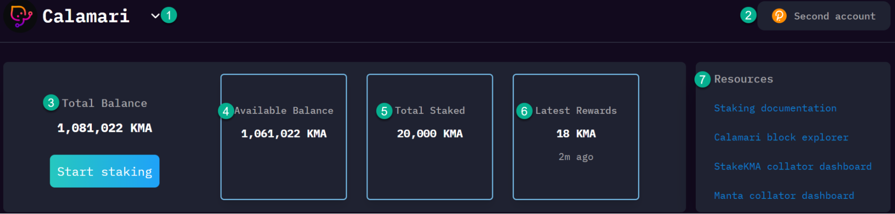
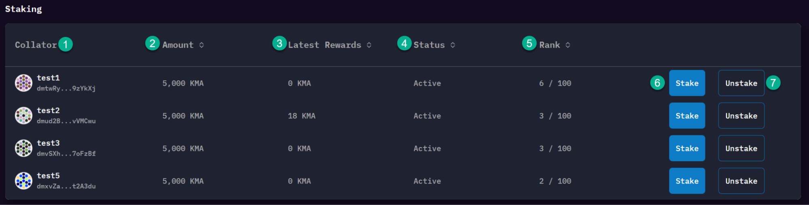
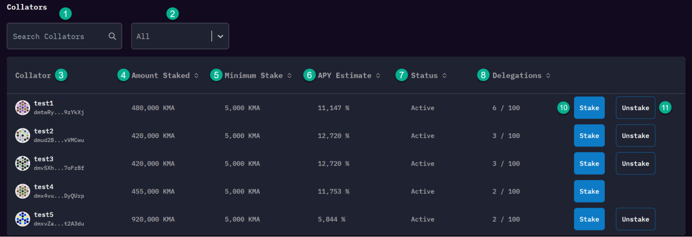

You can find the dApp at [app.manta.network/#/calamari/stake](app.manta.network/#/calamari/stake)

You'll notice it has the following elements:
## Header

1. The currently selected network
2. Your currently connected account through Polkadot.js
3. Your KMA balance for the connected account
    1. This includes delegated KMA, as well as any KMA within your account
4. Your KMA balance available to delegate
5. Your KMA balance currently staked
6. Your KMA earned during the last emission schedule
7. Helpful links such as the blockchain explorer and collator dashboards

## Staking Section

1. Collator name and address information
2. Amount of bonded KMA to this collator
3. Amount of rewards generated during the last round
4. Collator status. 
    1. Active - Collator is currently receiving rewards
    2. Inactive - Collator is not eligible to receive rewards
5. Your rank among the delegators that are staked to this collator (by amount of KMA)
6. Stake to this collator
7. Unstake from this collator (if applicable)

## Collator section

1. Find a collator
2. Filter out collators by Active vs Inactive
3. Collator information, such as the collator name and address
4. Amount staked to this collator
5. Minimum stake required for this collator
6. Estimated APY for this collator (note that APY is variable and subject to change)
7. Collator status. 
    1. Active - Collator is currently receiving rewards
    2. Inactive - Collator is not eligible to receive rewards
8. Number of delegators backing this collator
9. Stake to this collator
10. Unstake from this collator

I’m ready to stake. [Show me how](HowTo%20Delegate)
