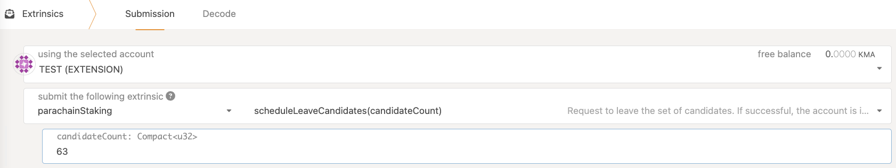
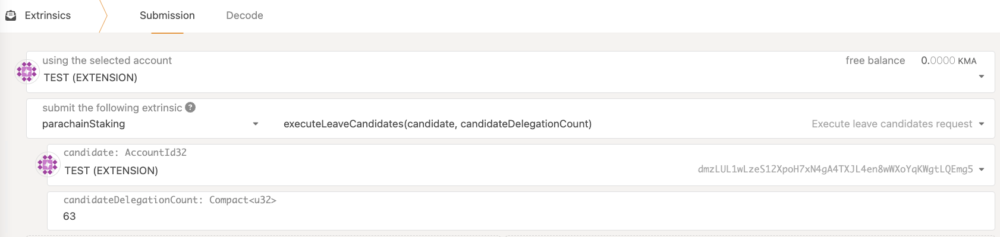
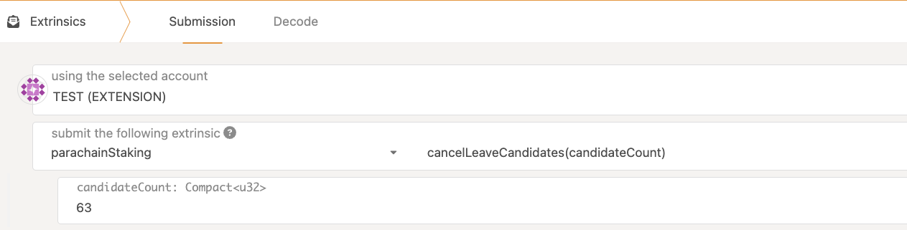

## 💔 Leave the Collator Set and Recover the KMA Bond

:::note
The screenshots below show example values for the `candidateCount` and `candidateDelegationCount` parameters. Ensure the number you provide to
- `candidateCount` is larger than the number of currently registered **collators** on the network
- `candidateDelegationCount` is larger than the number of **delegators** on the collator you want to unbond

It is not necessary to be exact, this parameter is a gas fee hint that is used to reserve a gas fee on execution.
Unused gas is refunded afterwards, so it is ok to use a large number here if you don't want to count and have enough KMA
:::

In order to fully offboard your collator, execute `parachainStaking::scheduleLeaveCandidates`

This will mark your collator as exiting, making it ineligible for future rewards.

**After 7 days** you (or anyone else) can execute the removal extrinsic for your collator which will unlock your bonded KMA 

If you change your mind, you can always cancel the unbonding (unless you've already sent the `execute` extrinsic above)
