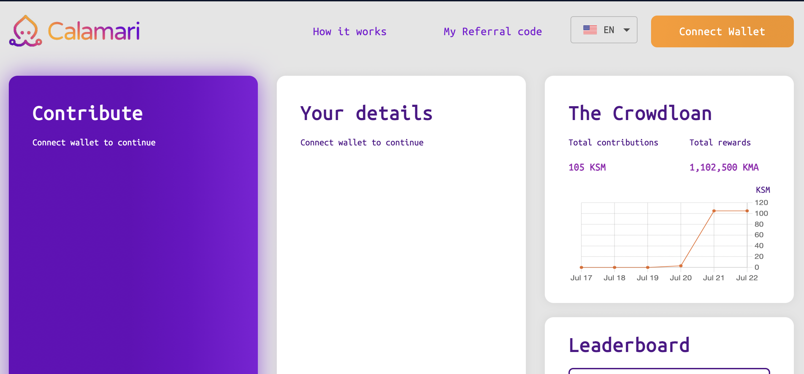

# Crowdloan

## What is it ?
All Kusama parachains compete for the chance to launch a blockchain on Kusama by participating in a parachain slot auction. A parachain slot auction is when teams bid in an auction for the chance to win a slot to launch a blockchain on Kusama for security and interoperability. To help the team raise funds to participate in the auction, Kusama allows teams to launch a `crowdloan` in the community.

`Crowdloan` allows a team to crowdsource KSM (for Kusama slots) or DOT (for Polkadot slots) to use to bootstrap its parachain auction. So crowdloan allows people to contribute by agreeing to lock up their own KSM (DOT) until the end of the lease. Teams can reward their contributors however they see fit, and can structure their crowdloan in various ways, hosting it either natively on Kusama (Polkadot) or on a 3rd-party platform. 

## How to join ours ?

### **Install polkadot.js/extension.**

Use polkadot.js/extension, you can login in our crowdloan system easily. If you haven't already installed it, go to https://polkadot.js.org/extension/ and add this extension to your browser. And also you can find how to add an account to this extension.

If you ready you can see it: 

### **Open our crowdloan page and login your account**

After you prepared your poilkadot.js/extension, go and open our crowdloan front page https://crowdloan.calamari.manta.systems. The first time we you open this page, you need to allow our crowdloan system to connect with polladot.js/extension. If you have down, you can see this page:

If you ready you can see it: 

### **Open our crowdloan page and login your account**

After you prepare ready for your polkadot.js/extension, go and open our crowdloan front page https://crowdloan.calamari.manta.systems. The first time we you open this page, you need to allow our crowdloan system to connect with polladot.js/extension. If you have down, you can see this page:

Choose the language you want, and then click the bottom `Connect Wallet` to login your account in our crowdloan system.

### **Claim your contribution**

You can start contributing now. Enter your contribution amount in the first inputbox the enter your referral code you got from our Manta community, like discord, element chat room or twitter. Click `Claim your KMA` and accept this operator in your extension. 

After the contribution process finishes (Under the `Claim your KMA` button, you can see a small line to show your contribution processing), you should see your rewards and contribution details.