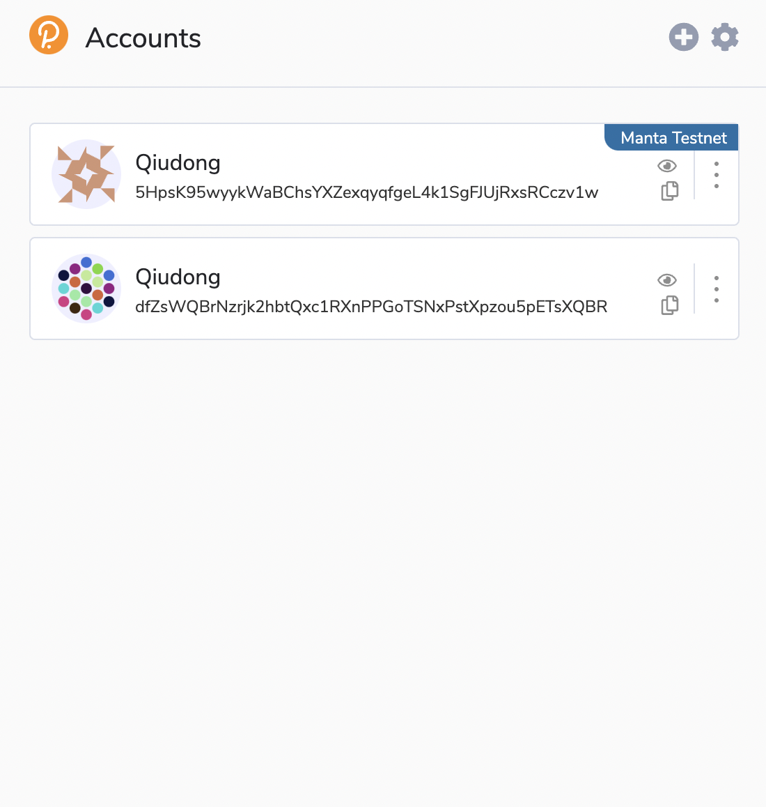
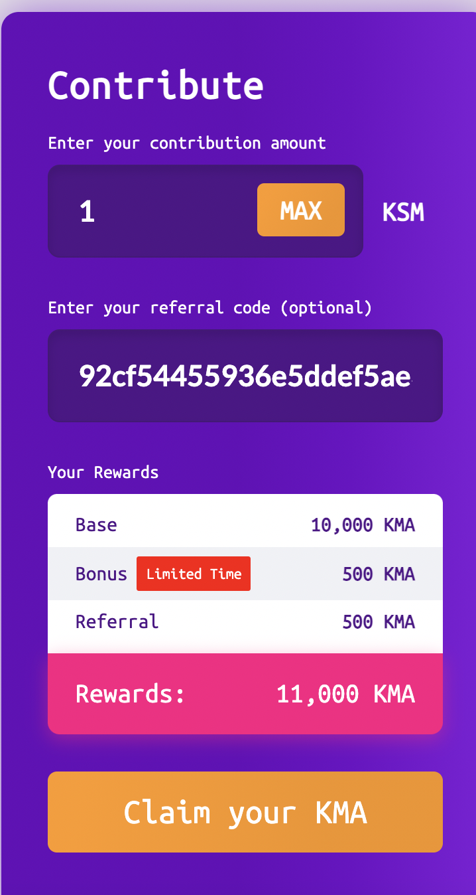

# Crowdloan

## What is a Crowdloan ?

Kusama is a network of blockchains that share consensus mechanisms for security and interoperability. Blockchains on the Kusama network are called parachains, and teams can win a spot for their blockchain by bidding in a parachain slot auction. Kusama allows teams to raise money for auctions through crowdloans from the community.

In a crowdloan, community contributers will lock up their own KSM or DOT until the end of a lease so a parachain team can bootstrap their parachain auction. (KSM are used for Kusama slots, and DOT for Polkadot slots). Teams can reward their contributors however they see fit, and can structure their crowdloan in various ways, hosting it either natively on Kusama (Polkadot) or on a 3rd-party platform.

## Details about Calamari Crowdloan

Calamari Network intends to begin its Parachain Loan Offering in conjunction with the start of the sixth Kusama parachain auction. The exact date marking the commencement of the sixth auction is unclear at the time of writing; the fifth auction is finishing up now, and will end on Friday, July 23, 2021. After that auction completes, there will be a review period before beginning the second batch of auctions (auctions 6 through 10). At the moment, the duration of the review period is unclear.

Anyone who participates in our Calamari PLO will be rewarded with $KMA, Calamari’s native token. Contributors will receive 10,000 KMAs per 1 KSM contributed. The fixed ratio guarantees that rewards for KSM contributors won’t change with the amount of KSM Calamari raised. This makes it fair for all participants, regardless of the when they enter. Also we are offering early bonuses to the first 1,000 contributors on our crowdloan. For more infomation, please read: [The Calamari Crowdloan on Kusama](https://mantanetwork.medium.com/the-calamari-crowdloan-on-kusama-74a3cb2a2a4b).

## How to join the Calamari Crowdloan ?

### **Install polkadot.js/extension.**

Using the polkadot.js/extension you can login into our crowdloan system easily. If you haven't already installed it, go to https://polkadot.js.org/extension/ and add the extension to your browser, and then add an account to the extension.

You will see your accounts show up like this: 

### **Open our crowdloan page and login your account**

After you've set up your polkadot.js/extension, go to the crowdloan page: https://crowdloan.calamari.manta.systems. The first time you open this page, you'll need to allow our crowdloan system to connect with the polladot.js/extension. Once it's connected to your account, you'll see:

### **Claim your contribution**

You can start contributing now. Enter your contribution amount in the first input box, and the referral code you got from our Manta community (e.g. from discord, element chat room or twitter). Click `Claim your KMA` and accept this operator in your extension.

After the contribution process finishes (Under the `Claim your KMA` button, you can see a small line to show your contribution processing), you should see your rewards and contribution details.

---

To learn more about Manta Network, please follow us on [Telegram](https://t.me/mantanetwork), [Twitter](https://twitter.com/mantanetwork) and [Medium](https://mantanetwork.medium.com) to get the latest news.
