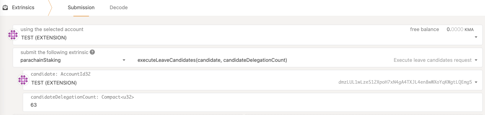

[Installation](installation) > [Configuration](configuration) > [Running](running) > [Sync](sync) > [Session keys](keys) > Bond

## 💔 Leave the Collator Set and Recover the KMA Bond

In order to fully offboard your collator, execute `parachainStaking::scheduleLeaveCandidates`

This will mark your collator as exiting, making it ineligible for future rewards.

**After 7 days** you (or anyone else) can execute the removal extrinsic for your collator which will unlock your bonded KMA 

If you change your mind, you can always cancel the unbonding (unless you've already sent the `execute` extrinsic above)
