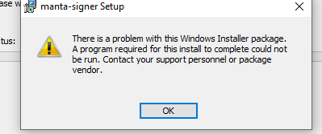

# Manta Signer

The **Signer** is a _secret manager_ and _[zero-knowledge proof](./ZKP.md) generator_ for use with Manta Network, Calamari Network, and Dolphin Testnet. 

## Why do you need the Signer?

The Manta protocols are privacy-first protocols, and zero-knowledge proofs are integral to the design and functionality of these protocols. The secrets that _only you_ know about represent your identity on the blockchain. The **Signer** will be the computational extention of those secrets, being able to construct proofs based on them. Then, you can send those proofs to the blockchain to update the ledger with the changes _only you_ can make to it.

Our goal is to improve the zero-knowledge proof generation performance to eventually get rid of signer.

## Difference between the Signer and Polkadot.js/Talisman wallets?

The Polakdot.js and Talisman wallets control the spending secrets of the public address. **Manta Signer** controls the spending secrets of [shielded addresses](./ShieldedAddress.md).

## Troubleshooting tips

On Windows 10, occasionally the installer will fail due to WebView2 not installing correctly. If this happens, you will see a message like so:

To fix this, you can try downloading and installing [WebView2 runtime](https://developer.microsoft.com/en-us/microsoft-edge/webview2/#download-section) directly.
