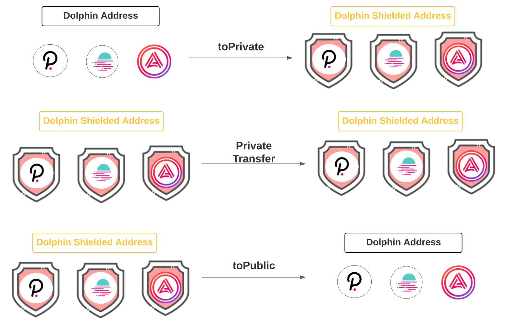

# 🐬 DolphinPay

DolphinPay enables BYOT (Bring your own token) private payment for Polkadot ecosystem assets. 
Below is the overview of DolphinPay:

## Try Dolphin (version Boto)
1. Download manta-signer, an native app to turbo-charge zero-knowledge proof generation.
   * [v0.4.1 Mac OS](https://github.com/Manta-Network/manta-signer/releases/download/0.4.1/Manta.Signer_0.4.1_x64-macOS.dmg)
   * Ubuntu/Debian: in testing phase, to be released
   * Windows: in testing phase, to be released
   For Mac, you might need to go to `System Preferences->Security & Privacy` to enable signer (we are working on get signer approved by Apple, but it takes time).
   
   When you first open signer, it will ask you to create a password and generate a 12 words mnemonics.

2. Get Testnet Tokens 

    Join Manta&Calamari's Discord, go to channel `#dolphin-faucet`. Type `/gimme` and you will see faucet options promp out:

    

    You should first claim `DOL`, since you need `DOL` to pay gas fees. Then, you can claim your favorite testnet tokens like `BTC`, `ETH`, `DOT`, etc.

3. Go to [Dolphin App](https://app.dolphin.manta.network/), try these hot baked Dolphin (version Boto) features:
    * Convert public tokens to private
      
      you can see your private token balance by switching to `private` option:
      

    * Send private tokens, private tokens are using a `One-Time Shielded Address`, which means before sending tokens to your friend, you need to get their one time shielded address through secure communication, such as Telegram or Signal.
      
    TO get your own `One-Time Shielded Address`, go the `private->receive->new address`:

    
      
    * Convert private tokens to pulic:
    

## FAQ

1. Why do I need manta-signer? Can I trust manta-signer?
   Manta-signer serves two purpose, first is to protect your secrets, second is using native code to do zero-knowledge proof generation. manta-signer runs locally and will never talk to a remote host, the signer code is open-sourced [here](https://github.com/Manta-Network/manta-signer) and will be security audited.

2. Is the private token in manta-signer secure?
   All the secrets to spend private tokens is stored locally in your computer and encrypted using [AES](https://en.wikipedia.org/wiki/Advanced_Encryption_Standard). manta-signer will never send your secrets online nor the signer 

3. What is a one time shielded address? how is the shielded address different from my generic polkadot/Manta address?
   Dolphin (Boto) uses a one time shielded address. This is a one-time address for your private token. For privacy and security, the address is longer than a typical generic polkadot/manta address. In the next version of the testnet, we will switch to reusable shielded address.

4. How can I recover private tokens?
   We will add recover feature to signer soon.

5. How does private payment work?
   [How does private payment work](PrivatePayment.md)