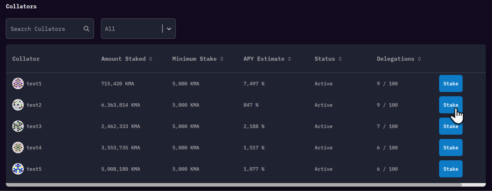

:::danger Staking dApp Has Been Replaced by the Migration DApp
The staking dApp is no longer active. **New staking closed on March 18, 2026**, and staking rewards ended on May 1, 2026.

If you still have staked MANTA, please use the **[Migration DApp](https://app.manta.network/manta/migrate)** to unstake and migrate your assets to Manta Pacific. The Migration DApp will automatically detect your staking status and guide you through the unstaking and migration process.

See the [Migration FAQ](/docs/manta-atlantic/migration-faq) for the full timeline and detailed instructions.
:::

:::note Historical Reference
The content below describes the staking dApp interface as it existed before deprecation.
:::

The staking dApp was available at [app.manta.network/manta/stake](https://app.manta.network/manta/stake)

You'll notice it has the following elements:
## Header

1. The currently selected network
2. Your currently connected account through Polkadot.js
3. Your MANTA balance for the connected account
    1. This includes delegated MANTA, as well as any MANTA within your account
4. Your MANTA balance available to delegate
5. Your MANTA balance currently staked
6. Your MANTA earned during the last emission schedule
7. Helpful links such as the blockchain explorer and collator dashboards

## Staking Section

1. Collator name and address information
2. Amount of bonded MANTA to this collator
3. Amount of rewards generated during the last round
4. Collator status. 
    1. Active - Collator is currently receiving rewards
    2. Inactive - Collator is not eligible to receive rewards
5. Your rank among the delegators that are staked to this collator (by amount of MANTA)
6. Stake to this collator
7. Unstake from this collator (if applicable)

## Collator section

1. Find a collator
2. Filter out collators by Active vs Inactive
3. Collator information, such as the collator name and address
4. Amount staked to this collator
5. Minimum stake required for this collator
6. Estimated APY for this collator (note that APY is variable and subject to change)
7. Collator status. 
    1. Active - Collator is currently receiving rewards
    2. Inactive - Collator is not eligible to receive rewards
8. Number of delegators backing this collator
9. Stake to this collator
10. Unstake from this collator

I’m ready to stake. [Show me how](HowTo%20Delegate)
