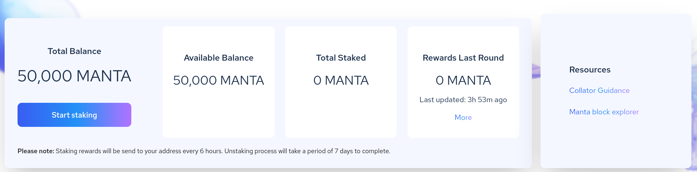
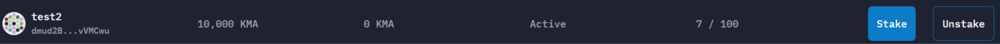

:::danger Staking Is No Longer Available — Please Migrate
**New staking closed on March 18, 2026. Staking rewards ended on May 1, 2026.** All remaining staked positions are being forcibly unbonded.

If you have staked MANTA that needs to be unstaked and migrated, please use the **[Migration DApp](https://app.manta.network/manta/migrate)** instead of the staking dApp.
:::

## How to Unstake and Migrate

Instead of the staking guide below, follow these steps to recover and migrate your MANTA:

### Step 1 — Connect to the Migration DApp

Visit the [Migration DApp](https://app.manta.network/manta/migrate) and connect using your Polkadot wallet (Polkadot.js / Talisman / SubWallet).

### Step 2 — Unstake your MANTA

The Migration DApp will automatically detect your staking status on Atlantic. If you have staked assets, the DApp will provide an option to unstake. Initiate unstaking and wait for the **7-day unbonding period** to complete.

### Step 3 — Choose a migration destination

Once unbonded, you can:
- **Migrate to Manta Pacific** — via the Manta Bridge cross-chain transfer (recommended for staying in the Manta ecosystem)
- **Migrate to Polkadot or other parachains** — via XCM transfer (for DOT, GLMR, and other assets going back to their native chains)

### Step 4 — Confirm and wait

Confirm the transaction and wait a few minutes for it to arrive at your destination. Under normal circumstances, a single migration transaction completes within a few minutes.

:::note Address Format Change
Atlantic uses Substrate address format (SS58), while Manta Pacific uses Ethereum address format (starting with 0x). The Migration DApp will guide you to connect your Ethereum wallet address to receive your assets. Make sure you control the private key / seed phrase for that Ethereum address.
:::

For the complete timeline and more details, see the [Migration FAQ](/migration-faq).

---

:::note Historical Reference — How Delegation Used to Work
The original delegation guide is preserved below for reference only. The staking dApp is no longer active.
:::

Before delegation was closed, users needed to be familiar with the [Staking Rules for Delegators](../Rules#for-delegators).

When visiting the Staking page for the first time, a pop up would appear asking you to allow polkadot.js access to the dApp.

After connecting, clicking the **Start Staking** button would open the collator selection view.

Choosing a collator and clicking Stake would present a pop up to enter the delegation amount. A minimum amount was required.

Once the transaction went through, staking was active and rewards were distributed every 6 hours.

