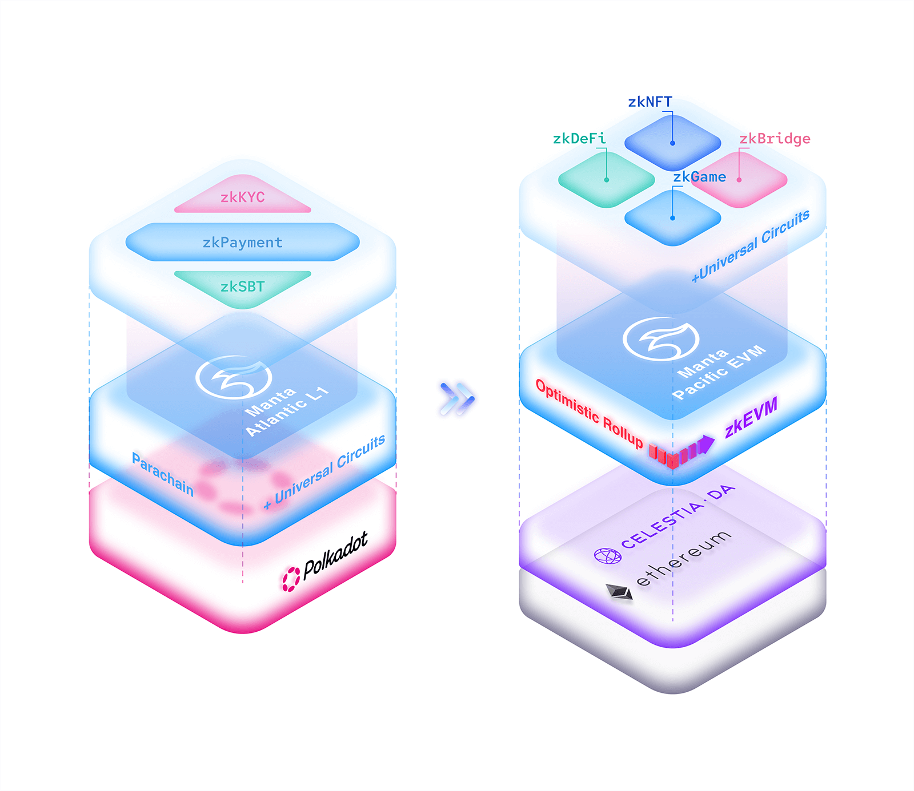

# Your Guide to MANTA: Understanding the Token and its Value

# Introduction

Manta Network is the modular ecosystem built for scalable, next-generation dApps. It currently offers two networks:

- **Manta Pacific**, the modular L2 ecosystem on Ethereum for next-generation dApps, provides a scalable and inexpensive gas-fee environment for applications to grow beyond the limits of traditional EVM environments.
- **Manta Atlantic**, the fastest ZK L1 chain on Polkadot, brings programmable ZK-powered confidential on-chain identities and credentials to web3 through zkSBTs.

Manta Network offers an unrivaled environment to deliver on the scalability demands of dApps. The ecosystem takes a modular approach to meet the changing market needs for dApps now and in the future.

# **Overview of $MANTA**

| Property           | Details                                     |
| ------------------ | ------------------------------------------- |
| Abbreviation       | MANTA                                       |
| Token Type         | ERC-20, Native                              |
| Total supply       | 1,000,000,000 MANTA                         |
| Inflation schedule | 2% yearly minting rate from Jan 30th, 2024. |
| Decimals           | 18                                          |
| Token contract     | 0x95CeF13441Be50d20cA4558CC0a27B601aC544E5  |
| Chain              | Manta Pacific                               |

- The total supply of $MANTA at Genesis: 1,000,000,000.
- 2% yearly minting rate starting from Token Genesis.
- Governance: $MANTA token holders can vote on network governance decisions on Manta Pacific and Manta Atlantic.
- Staking: Staking $MANTA contributes to the overall security of Manta Atlantic.
- Collator Delegation: $MANTA holders have the option to delegate their holdings with collators or stake $MANTA to run their collators to secure the network.
- Network Fees: Manta Atlantic uses $MANTA to pay transaction fees.
- Native Liquidity & Collateral: $MANTA token can be used in Manta ecosystem to serve as native liquidity and collateral.

## **$MANTA Utility on Manta Pacific**

Manta Pacific is designed to thrive on on-chain activities, generating value for token holders, contributors, builders, and users:

**Value Accrual for Token Holders:**

- Token holders benefit from the productive re-deployment of sequencer revenue and gas savings from modular DA.
- Sequencer revenue and DA gas fee savings primarily fund on-chain activities and zk applications, driving demand for blockspace.

**Builders and Contributors:**

- Builders and contributors receive direct benefits from retroactive on-chain activities funding and the markets it enables.
- A symbiotic relationship emerges as a well-funded ecosystem attracts builders, fostering the growth of tools, education, apps, and infrastructure.
- Revenue is distributed to ecosystem projects and public goods funding, continually incentivizing, fostering innovation, supporting early-stage projects, and driving the adoption of cutting-edge technologies in the Manta ecosystem.

**Users and Community Members:**

- Ongoing ecosystem and community incentives and project incentives funded by $MANTA benefit users and community members.
- The value extends from the advantages provided by on-chain activities and zk applications.

**Revenue Generation:**

- Demand for $MANTA blockspace generates revenue.
- Initial funding from the sequencer accrues to the Manta Foundation for redistribution.
- Future funding may accrue directly to the protocol through the sale of participation rights in Manta’s decentralized sequencing network.

## **$MANTA Utility on Manta Atlantic**

$MANTA serves various functions within the Manta Atlantic ecosystem:

**Network Usage Fee:**

- Transactions and contract/pallet executions incur a usage fee.
- 72% of network usage fees are allocated to ecosystem projects, enhancing incentives for apps built on Manta.
- 18% goes to the treasury, governed to incentivize network development and future parachain auctions.
- 10% is distributed to collators producing blocks containing transactions.

**Medium of Exchange:**

- $MANTA acts as the native currency for Manta Network, facilitating peer-to-peer transfers and transactions with contracts/pallets.
- $MANTA can purchase credentials like zkSBTs and zkKYCs within the network.

**Governance Rights:**

- $MANTA serves as the voting weight for on-chain governance decisions.
- It is utilized for proposing referenda, electing council members, and shaping the future of the Manta network.

**Network Security:**

- Collators play a crucial role in bundling transactions and supporting block liveness.
- $MANTA tokens incentivize collators, ensuring a robust and decentralized network.
- The network allocates an annual 2% of total issuance to stakers for maintaining network security.

A portion of the $MANTA supply is allocated to airdrops to reward the real, active, and pioneering users who participate in and support the Manta ecosystem.

# **$MANTA Token Allocation:**

$MANTA will initially have a total supply of 1,000,000,000 $MANTA distributed among the categories outlined in the chart and table below.

## **$MANTA Interoperability on Manta Pacific and Manta Atlantic**

The total initial supply of $MANTA at launch is 1 billion tokens. Both the Atlantic and Pacific networks will have a representation of these 1 billion tokens. As liquidity flows between the two networks, the tokens will be locked and unlocked on liquidity pool of the Celer bridge ([audits and open source code available here](https://cbridge-docs.celer.network/reference/audit-reports)). The total amount of unlocked tokens from both Manta Atlantic and Manta Pacific determines the current circulating supply.

**$MANTA Tokens Launched on Manta Atlantic**

Tokens allocated to the Public Investors, Private Investors, Strategic Investors, Institutional Investors, Foundation, Team, and Advisors will be distributed and unlocked on Manta Atlantic. Manta Pacific has a contract that locks its supply of tokens allocated for Atlantic. As the Atlantic tokens are unlocked according to vesting, the Pacific contract will deploy the corresponding unlocked tokens into the Celer liquidity pool. By doing this, token holders are able to bridge between the two networks.

**$MANTA Tokens Launched on Manta Pacific**

Tokens allocated to Airdrop 1 (Into the Blue), Airdrop 2 (New Paradigm), the Binance Launchpool, and Ecosystem/Community will be distributed and unlocked on Manta Pacific. Similarly as described above, a contract will lock and unlock tokens through the Celer liquidity pool.

**Efforts Towards Transparency**

In the future, these metrics will be displayed through a dashboard in an effort towards transparency. Furthermore, once the contracts are deployed, they will be verified and published on-chain.

# **Token Release Schedule**

The initial circle supply of MANTA at TGE will be 251,000,000. During the TGE phase, the released MANTA tokens will be allocated for Airdrop, New Paradigm (Airdrop 2), Public Sale, Advisors, and Ecosystem & Community.

Note: MANTA total supply at Genesis is 1,000,000,000. Additional tokens will be issued under the “ Estimated Validator / Emission Rewards” token allocation

## **Airdrop — 5.60%**

Read the [Airdrop announcement](https://mantanetwork.medium.com/into-the-blue-the-official-manta-airdrop-59dc9f938575) for detailed eligibility criteria. The airdrop will be claimable for a period of 6 months starting on January 18, 2024 until June 18, 2024 at 11:59PM UTC.

_Release Schedule:_

- _50,000,000 $MANTA of “Into the Blue” event token airdrop will unlock during TGE._
- _6,000,000 $MANTA will unlock during TGE and be distributed to users participating in the Binance Parachain auction._
- _For any unclaimed rewards after the claim period, the unclaimed rewards will be distributed back into the ecosystem funds, where community governance will determine how to reappropriate._

## **New Paradigm (Airdrop 2) — 6.5%**

To position Manta as a leading Layer 2 solution in the Layer 2 landscape, we have introduced our groundbreaking product, New Paradigm. This innovative Layer 2 offering not only provides real yield but also rewards users with a range of benefits. 6.5% of $MANTA total supply will be allocated to New Paradigm Participants.

Read the details about [the New Paradigm](https://mantanetwork.medium.com/new-paradigm-the-real-l2-that-helps-you-earn-more-yield-than-a-multisig-2f445ab4dc47).

- **Base Reward:** 3% of total supply
- **Special Rewards:** 2% of total supply
- **Ecosystem incentives:** 1.5% of total supply

_Release Schedule:_

- _50,000,000 $MANTA NFT reward will be released at TGE_
- _15,000,000 $MANTA ecosystem incentives will be released 3 months after TGE._
- _For any unclaimed rewards after the claim period, the unclaimed rewards will be distributed back into the ecosystem funds, where community governance will determine how to reappropriate._

## **Binance Launchpool — 3.00%**

For participants in the Binance Launchpool for $MANTA token.

_Release Schedule:_

- _100% release at TGE_

## **Public Sale — 8.00%**

8% of $MANTA total supply will be allocated for participants in Squad Game, the crowd sale of $MANTA tokens.

_Release Schedule:_

- _40,000,000 $MANTA at TGE; the remainder is released monthly (at the end of each month) over 6 months._

## **Private Round — 12.94%**

12.94% of $MANTA total supply will be allocated for private investors.

_Release Schedule:_

- _12 months cliff and linear release over 36 months._

## **Strategic Investors — 6.17%**

6.17% of $MANTA total supply will be allocated for strategic investors.

_Release Schedule:_

- _12 months cliff and linear release over 36 months._

## **Institution Investors — 5.00%**

6% of $MANTA total supply will be reserved for institutional investors.

_Release Schedule:_

- _12 months cliff and linear release over 36 months._

## **Ecosystem / Community — 21.19%**

$MANTA tokens will be distributed via grants and incentives to contributors, builders, and ecosystem partners through on-chain governance. Details about on-chain governance structure and workflow will be published separately. Initial release from this tranche will go towards efforts including liquidity provisioning and ecosystem projects and partners. Please follow [Manta Network on Twitter](https://twitter.com/mantanetwork) for the latest information.

_Release Schedule:_

- _50,000,000 $MANTA at TGE; the remainder is released linearly over 48 months. The tokens will be distributed through governance._

## **Foundation Treasury- 13.50%**

Manta Foundation Treasury is established to guide the Manta ecosystem and uphold its values. Details regarding the Manta Foundation and governance will be released soon.

_Release Schedule:_

- _Linear release over 72 months._

## **Team — 10.00%**

For current and future core team members contributing to the growth and success of Manta Network.

_Release Schedule:_

- _18 months cliff and 48 months linear release._

## **Advisors — 8.10%**

All of the hard work and success would not have been achieved without the advice and support from industry leaders. Advisor allocation is given to those who have helped Manta Network achieve the success it has witnessed thus far and into the future.

_Release Schedule:_

- _25,000,000 $MANTA at TGE; the remainder is released monthly (at the end of each month) over 30 months._

## **Estimated Validator / Emission Rewards — 2% per year**

Starting from TGE, the network allocates an annual 2% of total issuance to stakers for maintaining network security. Additional tokens will be issued as part of the Estimated Validator / Emission Rewards token allocation.

_Release Schedule:_

- _The total supply of $MANTA at Genesis is 1,000,000,000._
