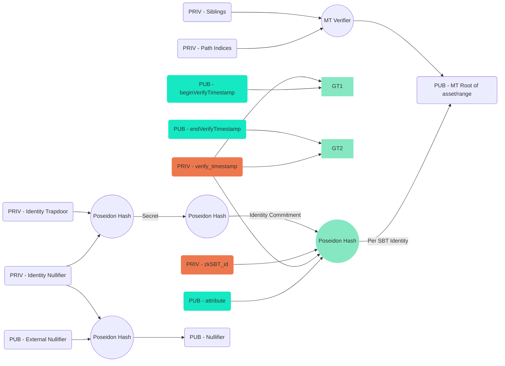

# zksbt : design V2

## zksbt V1 问题
zksbt V1集成(POMP)下来发现新的需求
- 同一个category/attribute的pomp要能够mint多次，通过verify time来区分.
- pomp幅度(range)较多.
- npo/pomp 上新较多，减少合约上新流程. (第一个mint时创建group)

semaphore 现有的merkle tree membership prove不太适用 :
- NPO/POMP上新类别多，特别是POMP，多条链，各种资产，各种不同的Range，每个组合都是一个semaphore group，每次上新，需要发送大量交易
- depth 32 group中add member需要>1M的gas cost(ETH 2000U, gas price 0.1G, 约为0.2U)
<!-- - zksbt是为web2 verify服务，通过proof key接入web2，链上验证的需求少. -->
<!-- - 是否需要链上Privacy Verify ? 从[产品描述](https://docs.manta.network/docs/guides/npo/About) 看是不需要的，privacy verify只有走proof key. -->

<!-- zksbt的核心需求是 :
- public address拥有zksbt, 链上数据证明.
- 对于public address有所有权，通过semaphore identity proof解决.

因此V2考虑简化设计，不再使用semaphore merkle tree group membership.

- 然而由于收gas fee的需求，以太坊无法隐藏地址，而relayer又太麻烦，本质上是public mint.
- 要保留链上private verify的可能性.而这会有collision，也是merkle tree的应用场景.
- 未来如果on-chain private verify完全没用，则可以升级合约，降到V2.
    * 去掉group
    * circuit降到V2
 -->

## V2

1. merkle tree group保留on-chain privacy verify的可能性
    - depth 16, 降低mint gas
    - leave存储 hash(identity, sbt_id, verify_time)
2. sbt id 唯一
3. hash(attribute), 作为public input.
    - 上新只需要上category, 而range作为sbt的metadata信息. privacy verify时使用.
5. circuit 中验证timestamp
    - privat verify_time >= given  public begin_verify_time
    - privat verify_time <= given  public end_verify_time,

