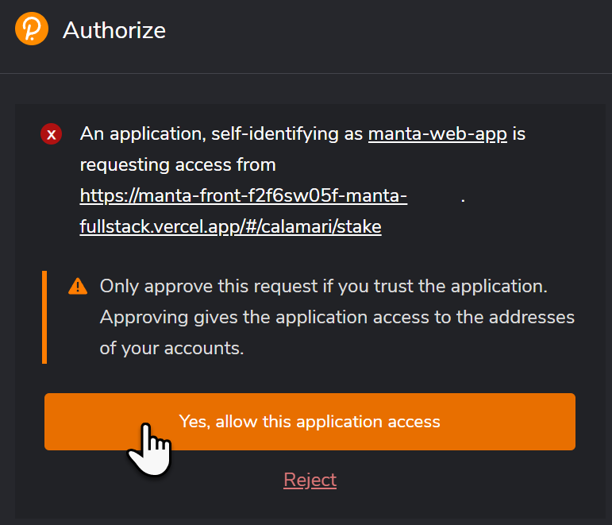
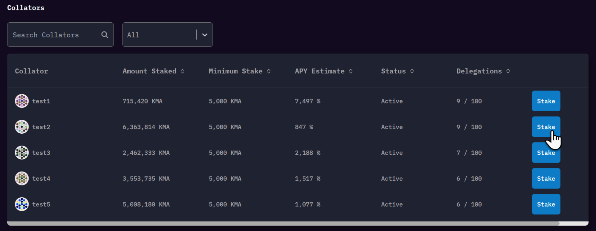

在开始之前，请确定您已经熟悉了 [质押规则](../Rules#for-delegators)

第一次访问 Staking 页面，会看到一个弹窗，允许 Polkadot.js 访问 dApp

点击“Yes”，连接 dApp，点击“Start Staking”开始质押

选择 Collator，点击“Stake”

然后，会有一个小弹窗，提示输入委托数额。注意，最小质押数量。

成功！交易成功后，稍等片刻，会看到您正在质押的 KMA。

奖励每 6小时发放一次，详情将在面板上更新。

如有问题，请在[Discord](https://discord.gg/mantanetwork)上与我们联系。
