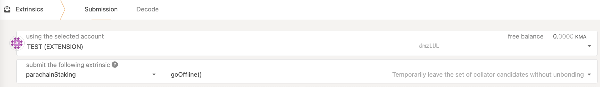
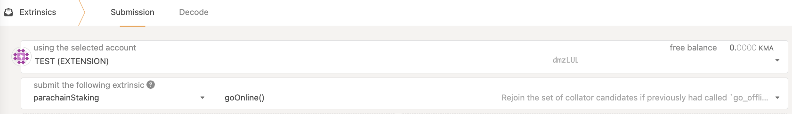

# 维护

### Manta 二进制升级

尽管 [无分叉升级](https://wiki.polkadot.network/docs/learn-runtime-upgrades#forkless-upgrades) 基本上允许在不需要改变节点软件的情况下进行升级，但是每隔一段时间，链升级都会破坏客户端的二进制文件，而需要手动更新。

:warning: 请密切关注 [Manta 节点 github 发布](https://github.com/Manta-Network/Manta/releases) 中的更新指引。

### Collator 节点下线

如果你的 collator 节点将下线超过6小时，你可以 (也应当) 通过在 collator 账户中运行`parachainStaking::goOffline()` 来通知网络。

你将会暂时被从候选人的队列中移除（你的 collator 节点并不会被移除），这将从执行后（最长6小时）下一轮生效。

在下线期间，你或你的委托者都无法收到奖励（不管你是否运行上面的 extrinsic），所以请尽量将你的下线时间降到最低，否则你有可能会失去你的委托者，甚至有可能被从活跃 collator 的队列中移除。

一旦你结束维护，你可以通过执行 `parachainStaking::goOnline()`重新将你的 collator 加入到活跃队列中来。

同样的，这也会在执行后（最长6小时）下一轮开始生效。
