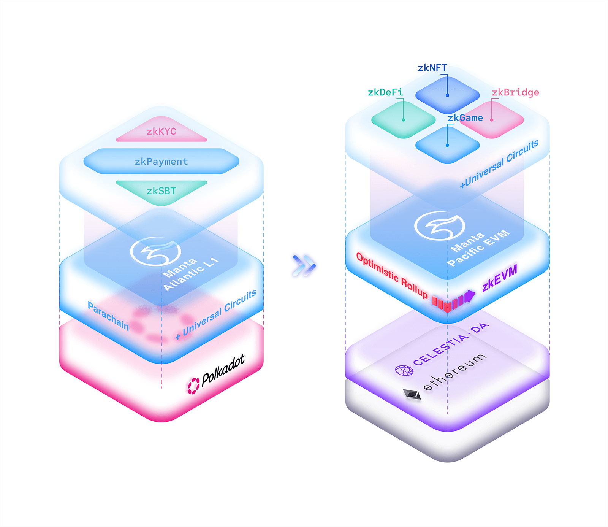

# 理解Manta代币及其价值

# 简介

Manta Network是为可扩展的下一代dApps构建的模块化生态系统。它目前提供两个网络：

-   **Manta Pacific**，基于以太坊的下一代dApps的模块化L2生态系统，为应用提供可扩展且廉价的Gas费用环境，使其能够超越传统EVM环境的限制。
-   **Manta Atlantic**，是Polkadot上最快的ZK L1链，通过zkSBTs为Web3引入可编程的ZK动力机密链上身份和凭据。

Manta Network提供了一个无与伦比的环境，以满足dApps可扩展性的需求。该生态系统采用模块化方法，以满足dApps现在和未来的不断变化的市场需求。

# $MANTA概览 

| 属性            | 值                                     |
| --------------------- | ------------------------------------------- |
| 缩写       | MANTA                                       |
| 代币类型        | ERC-20, Native                              |
| 总供应量     | 1,000,000,000 MANTA           |
| 通胀 | 从2024年1月30日开始的年增发率为2% |
| Decimals              | 18                                          |
| MANTA (Manta Pacific) | 0x95CeF13441Be50d20cA4558CC0a27B601aC544E5  |
| MANTA (BSC)           | 0x8581cc815e40615998f4561f3e24e68066293595  |
| xcMANTA (MoonBeam)      | 0xfFFffFFf7D3875460d4509eb8d0362c611B4E841  |
| 链                 | Manta Pacific                               |

-   $MANTA在创世时的总供应量：1,000,000,000。 
-   从代币创世开始的年增发率为2%。
-   治理：$MANTA代币持有者可以对Manta Pacific和Manta Atlantic上的网络治理决策进行投票。
-   质押：质押$MANTA有助于Manta Atlantic的整体安全性。
-   汇编委托：$MANTA持有者可以选择将其持有的负载与整合者委托，或者质押$MANTA来运行其整合者以确保网络安全。
-   网络费用：Manta Atlantic使用$MANTA支付交易费用。
-   本地流动性和抵押：$MANTA代币可在Manta生态系统中用作本地流动性和抵押。

## $MANTA在Manta Pacific上的实用性

Manta Pacific旨在通过链上活动产生价值，为代币持有者、贡献者、构建者和用户提供：

**代币持有者的价值积累：**

-   代币持有者从序列化收入和模块DA的燃气节省中获益。 
-   序列器收入和DA燃气费用节省主要用于链上活动和zk应用程序，推动对块空间的需求。 

**构建者和贡献者：**

-   构建者和贡献者直接受益于追溯的链上活动资金和其启用的市场。 
-   随着资金充足的生态系统吸引构建者，一种共生关系出现，促进了工具、教育、应用程序和基础设施的增长。 
-   收入分配给生态系统项目和公共物品资金，不断激励、促进创新，支持早期项目，并推动在Manta生态系统中采用先进技术。 

**用户和社区成员：**

-   $MANTA的持续生态系统和社区激励以及由$MANTA资金支持的项目激励将使用户和社区成员受益。 
-   这一价值延伸于由链上活动和zk应用程序提供的优势。 

**收入生成：**

-   对$MANTA块空间的需求产生收入。 
-   序列器的初始资金积累到Manta基金会进行再分配。 
-   未来资金可能会直接通过出售Manta去中心化排序网络的参与权益而积累到协议。 

## **$MANTA在Manta Atlantic上的实用性 **

$MANTA在Manta Atlantic生态系统中发挥多种功能：

**网络使用费：**

-   交易和合同/托盘执行会产生使用费。 
-   72%的网络使用费用分配给生态系统项目，增强了在Manta上构建的应用的激励。 
-   18%进入国库，由治理机构进行管理，以激励网络开发和未来的平行链拍卖。 
-   10%分配给包含交易的区块的整合者。 

**交换媒介：**

-   $MANTA充当Manta Network的本地货币，促进点对点的转账和与合同/托盘的交易。 
-   $MANTA可以在网络内购买像zkSBTs和zkKYCs这样的凭据。 

**治理权利：**

-   $MANTA作为链上治理决策的投票权重。 
-   它用于提出公决、选举理事会成员，并塑造Manta网络的未来。 

**网络安全：**

-   整合者在捆绑交易和支持块存活方面发挥着至关重要的作用。 
-   $MANTA代币激励整合者，确保网络的稳健和去中心化。 
-   网络将年度2%的总发行量分配给质押者，以维护网络安全。 

$MANTA供应的一部分将分配给AirDrop，以奖励参与和支持Manta生态系统的真实、活跃和开创性用户。

# $MANTA代币分配： 

$MANTA最初的总供应量为10亿$MANTA，分配给以下图表和表格中概述的各类别。

## $MANTA在Manta Pacific和Manta Atlantic上的互操作性 

在启动时，$MANTA的总初始供应量为10亿枚代币。大西洋和太平洋两个网络都将有这10亿枚代币的代表。随着两个网络之间的流动性流动，代币将在Celer桥的流动性池中锁定和解锁 ([审计和开源代码可在此处获得](https://cbridge-docs.celer.network/reference/audit-reports))。从Manta Atlantic和Manta Pacific解锁的代币的总金额确定了当前的流通供应量。

**在Manta Atlantic上启动的$MANTA代币**

分配给公共投资者、私人投资者、战略投资者、机构投资者、基金会、团队和顾问的代币将分发和解锁在Manta Atlantic上。Manta Pacific有一个锁定其用于大西洋的代币供应的合同。随着大西洋代币按照分层的方式解锁，太平洋合同将相应的解锁代币部署到Celer流动性池中。通过这样做，代币持有者能够在两个网络之间进行桥接。

**在Manta Pacific上启动的$MANTA代币**

分配给AirDrop1（Into the Blue）、AirDrop2（New Paradigm）、币安启动池和生态系统/社区的代币将在Manta Pacific上分发和解锁。与上述类似，一份合同将通过Celer流动性池锁定和解锁代币。

**迈向透明度的努力**

在将来，这些指标将通过仪表板显示，以努力提高透明度。此外，一旦合同部署，它们将在链上得到验证并发布。

# **代币释放计划 **

在TGE时，MANTA的初始供应量为2.51亿。在TGE阶段，发布的MANTA代币将分配给AirDrop、New Paradigm（AirDrop2）、公开销售、顾问和生态系统与社区。

注意：MANTA在创世时的总供应量为10亿。额外的代币将根据“估计的验证器/发行奖励”代币分配进行发行。

## **Airdrop — 5.60%**

请查看详细的资格标准的 [空投公告](https://mantanetwork.medium.com/into-the-blue-the-official-manta-airdrop-59dc9f938575) 。AirDrop将在2024年1月18日至2024年6月18日晚上11:59（UTC）的6个月期间可领取。

_释放计划：_

-   _“Into the Blue”事件的空投代币50,000,000 $MANTA将在TGE期间解锁。_
-   _600万$MANTA将在TGE期间解锁，并分发给参与币安平行链拍卖的用户。_
-   _对于认领期后未领取的奖励，未领取的奖励将重新分配回生态系统基金中，社区治理将决定如何重新分配。_

## **New Paradigm (Airdrop 2) — 6.5%**

为了将Manta定位为Layer2解决方案中的领先者，我们推出了创新的产品，New Paradigm。这个创新的Layer 2方案不仅提供实际产出，还奖励用户一系列的好处。$MANTA总供应量的6.5%将分配给New Paradigm参与者。

阅读关于 [the New Paradigm](https://mantanetwork.medium.com/new-paradigm-the-real-l2-that-helps-you-earn-more-yield-than-a-multisig-2f445ab4dc47)的详细信息。

-   **基础奖励**：总供应的3%。 
-   **特别奖励：**总供应的2%。 
-   **生态激励：**总供应的1.5%。

_释放计划：_

-   _50,000,000 $MANTA NFT奖励将在TGE时释放。_
-   _15,000,000 $MANTA生态激励将在TGE后的3个月释放。_
-   _对于认领期后未领取的奖励，未领取的奖励将重新分配回生态系统基金中，社区治理将决定如何重新分配。_

## **Binance Launchpool — 3.00%**

给$MANTA代币参与币安启动池的参与者。

_释放计划：_

-   _TGE时100%释放_

## **公开销售 — 8.00% **

$MANTA总供应的8%将分配给Squad Game，即$MANTA代币的众筹销售的参与者。

_释放计划：_

-   _TGE时40,000,000 $MANTA;其余部分将每月（每月底）释放一次，共持续6个月。_

## **私人轮 — 12.94% **

$MANTA总供应的12.94%将分配给私人投资者。

_释放计划_

-   _12个月的爬坡和36个月线性释放。_

## **战略投资者 — 6.17% **

$MANTA总供应的6.17%将分配给战略投资者。

_释放计划_

-   _12个月的爬坡和36个月线性释放。_

## **Institution Investors — 5.00%**

6% of $MANTA total supply will be reserved for institutional investors.

_Release Schedule:_

-   _12 months cliff and linear release over 36 months._

## **生态系统/社区 — 21.19% **

$MANTA代币将通过赠款和激励分发给贡献者、构建者和生态系统伙伴，通过链上治理。关于链上治理结构和工作流程的详细信息将分别发布。这个款项的初始释放将用于提供流动性和生态系统项目和合作伙伴等方面的努力。请关注Manta Network的Twitter [Manta Network on Twitter](https://twitter.com/mantanetwork) 获取最新信息。

_释放计划_

-   _TGE时50,000,000 $MANTA;其余部分将在48个月内线性释放。代币将通过治理分发。_

## 基金会财政- 13.50% 

Manta Foundation Treasury成立是为了引导Manta生态系统并维护其价值观。关于Manta Foundation和治理的详细信息将很快发布。

_释放计划_

-   _在72个月内线性释放。_

## 团队 — 10.00% 

为当前和未来为Manta Network的增长和成功做出贡献的核心团队成员。

_释放计划_

-   _18个月的爬坡和48个月的线性释放。_

## 顾问 — 8.10% 

所有的辛勤工作和成功都得益于产业领袖的建议和支持。顾问分配是给予那些帮助Manta Network迄今为止取得成功并在未来继续成功的人。

_释放计划_

-   _TGE时25,000,000 $MANTA;其余部分将每月（每月底）释放一次，共持续30个月。_

## 估计的验证者/发行奖励 — 每年2% 

从TGE开始，网络将每年分配2%的总发行量给质押者，以维护网络安全。作为估计的验证者/发行奖励代币分配的一部分，将额外发行代币。

_释放计划_

-   _每年分配2%的总发行量。_
